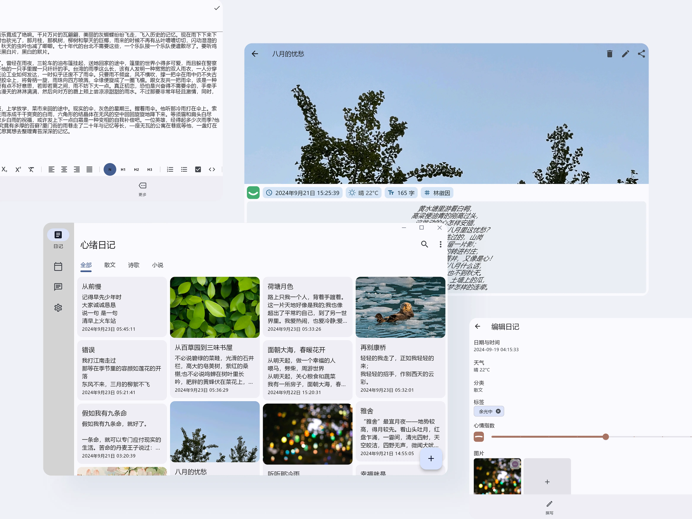

# 📔 Moodiary

[简体中文](README.md)丨English

「Moodiary」 is an open source, ad-free, social-free cross-platform private journal written with Flutter. Designed with Material Design, simple and easy to use.

    

## ✨ Feature

- **Cross-platform support**：🌍 Compatible with Android, iOS\*, Windows, MacOS\*, Linux\*.
- **Material Design**：🎨 The interface is intuitive and user-friendly, and follows the Material Design specifications.
- **Rich text editing**：📝 Supports text editing in bold, italic, underline and other formats.
- **Multimedia accessories**：📷 You can add pictures and audio to your diary.
- **Search and classification**：🔍 Easily manage your diary by full-text search and categorization.
- **Custom theme**：🌈 Supports choice of light and dark modes, or custom themes.
- **Data security**：🔒 Keep your diary safe with a password.
- **Export and share**：🧾 Support all data import/export, as well as single diary sharing.
- **Cloud synchronization**：☁ Support for synchronizing diaries across multiple devices (coming soon).
- **Natural Language Processing (NLP)**：🤖 Let your diary more understand you.

(Note: Cross-platform capabilities are provided by Flutter, platforms with * may require more testing)

## 🔧 Main Technology stack

- [Flutter](https://github.com/flutter/flutter)
- [Isar](https://github.com/isar/isar)
- [GetX](https://github.com/jonataslaw/getx)

## 📸 Application screenshot

### Mobile


### Desktop



## 🚀 Installation guide

### Third party SDK

Some capabilities need to apply for third-party SDKS, and the following service providers provide free versions, and the obtained keys are configured in the lab.

#### Weather service

- [QWeather](https://dev.qweather.com/docs/api/)

### Direct mounting

Use it by downloading the compiled installation package in Release, or manually compiling it if you don't have the platform you need.

### Manual compilation

#### Environmental requirement

- Flutter SDK (>= 3.26.0-0.1.pre, Because I use features that have not been incorporated into the stable version, I can only use the beta version and will migrate as soon as the stable version is updated)
- Dart (>= 3.6.0)
- Compatible ides (e.g. Android Studio, Visual Studio Code)

#### Installation procedure

> Note: When packaging, you need to modify the corresponding platform configuration file, such as Android platform build.gradle

1. **Clone Repo**：

   ```bash
   git clone https://github.com/ZhuJHua/moodiary.git
   cd moodiary
   ```

2. **Installation dependency**：

   ```bash
   flutter pub get
   ```

3. **Running application**：

   ```bash
   flutter run
   ```

4. **Package release**：

   - Android: `flutter build apk`
   - iOS: `flutter build ios`
   - Windows: `flutter build windows`

## 📝 More description

### Natural Language Processing (NLP)

Today, more and more industry products are beginning to incorporate AI technology, which undoubtedly greatly improves our experience. However, for diary applications, it is not acceptable to hand over the data to a large model because it is not certain that the data will be used for training. Therefore, a better approach is to adopt a local model. Although local models may not be as powerful as large models due to size limitations, they can still provide necessary help to a certain extent.

So far, I have integrated the following tasks:

#### SQuAD task based on Bert pre-trained model

I used MobileBert for the SQuAD task, which is a simple machine reading comprehension task. You can ask it questions and it will return the answers you need. The model file is in the '.tflite 'format required by TensorFlow Lite, and the size of the model is about 50MB after quantization.

Thanks to the following open source projects:

- [Chinese MobileBERT](https://github.com/ymcui/Chinese-MobileBERT)
- [Mobilebert](https://github.com/google-research/google-research/tree/master/mobilebert)
- [ChineseSquad](https://github.com/junzeng-pluto/ChineseSquad)

## 🤝 Contribution guide

Contributions are welcome! Please follow these steps to contribute:

1. Fork this repository.
2. Create a new branch(`git checkout -b feature-branch-name`)。
3. Commit your changes(`git commit -am 'Add some feature'`)。
4. Push to branch(`git push origin feature-branch-name`)。
5. Create a Pull Request.

Please make sure that your code to follow [Flutter style guide](https://flutter.dev/docs/development/tools/formatting) and include the appropriate tests.

## 📄 License

This project is licensed under the AGPL-3.0 LICENSE, see the [LICENSE](LICENSE) file for details.

## 💖 Thanks

- Thanks to the Flutter team for the excellent framework.
- Special thanks to the open source community for their valuable contributions.