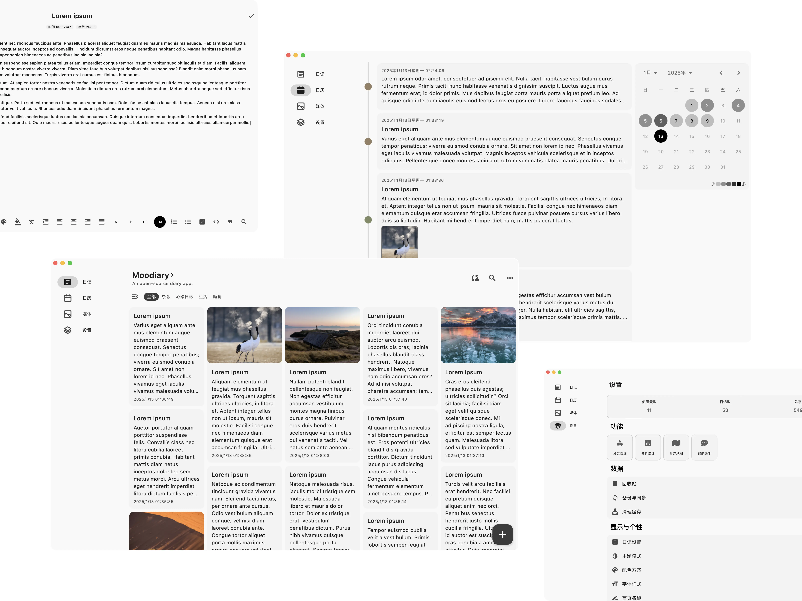
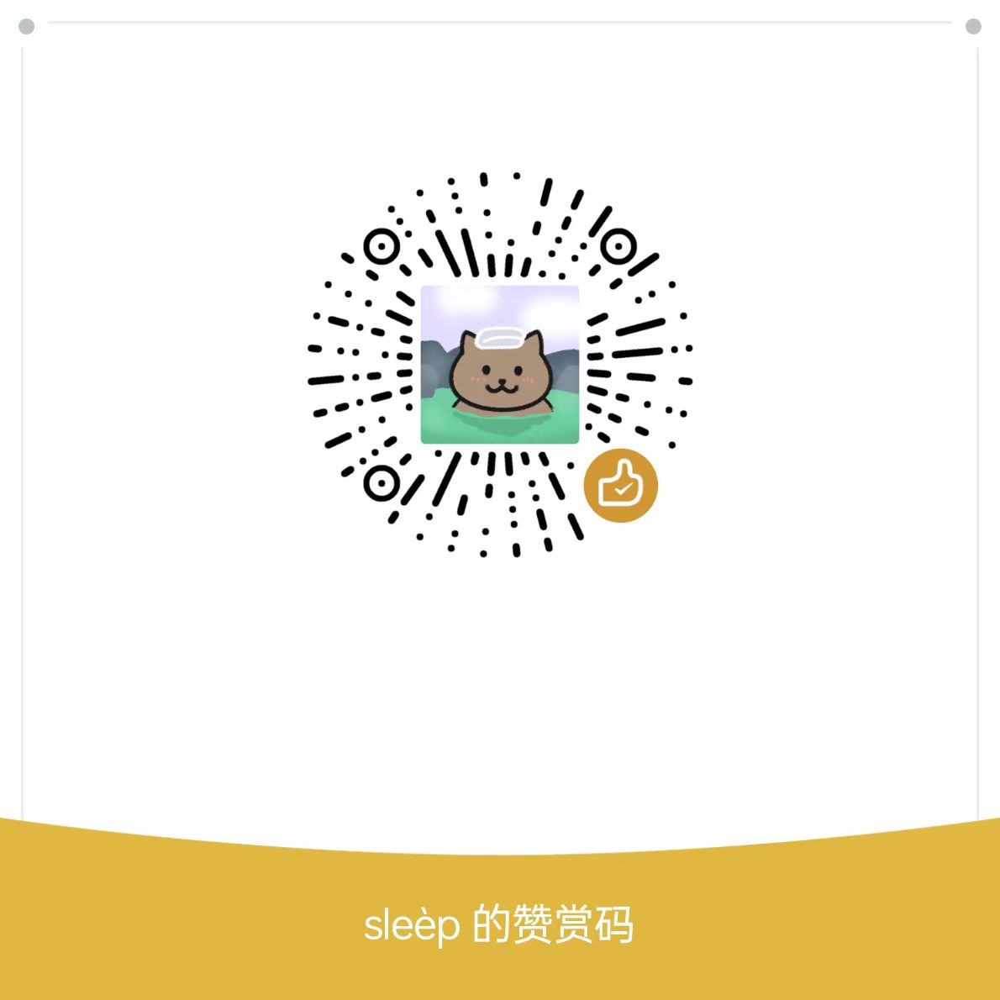

<picture>
  <source media="(prefers-color-scheme: dark)" srcset="res/banner/dark_zh.svg">
  <source media="(prefers-color-scheme: light)" srcset="res/banner/light_zh.svg">
  
</picture>

<p align="center">简体中文 | <a href="README.en.md">English</a></p>

<p align="center">QQ 交流群：760014526</p>

<div align="center">
  
  
  
  
  
</div>

## ✨ 功能特性

- **跨平台支持**：🌍 兼容 Android、iOS\*、Windows\*、MacOS\*、Linux。
- **Material Design**：🎨 界面直观且用户友好，遵循 Material Design 设计规范。
- **富文本编辑**：📝 支持加粗、斜体、下划线等多种格式的文本编辑。
- **多媒体附件**：📷 可以为你的日记添加图片、音频、视频甚至画一张画。
- **搜索和分类**：🔍 轻松通过全文搜索及分类管理你的日记。
- **自定义主题**：🌈 支持浅色和深色模式，以及多种配色的主题。
- **数据安全**：🔒 通过密码来保障你的日记安全，支持通过生物识别解锁。
- **导出和分享**：🧾 支持所有数据的导入/导出，以及单篇日记的分享。
- **备份与同步**：☁ 支持局域网同步，快速在设备间同步数据，以及 WebDav 备份。
- **足迹地图**：🗺️ 在地图上查看你足迹，生活中的每一步都值得被记录。
- **智能助手**：💬 支持接入第三方大模型，提供问答、情绪分析等功能。
- **本地自然语言处理（NLP）**：🤖 更安全的智能助手，让你的日记更懂你。

（注：跨平台能力由 Flutter 提供，带 * 号的平台可能需要自行配置签名）

## 🔧 主要技术栈

- [Flutter](https://github.com/flutter/flutter)（跨平台 UI 框架）
- [Isar](https://github.com/isar/isar)（高性能本地数据库）
- [GetX](https://github.com/jonataslaw/getx)（状态管理框架）

## 📸 应用截图

> 应用持续更新中，新版本界面可能稍有变化

### 移动端

<picture>
  <source media="(prefers-color-scheme: dark)" srcset="res/screenshot/mobile_dark.webp">
  <source media="(prefers-color-scheme: light)" srcset="res/screenshot/mobile_light.webp">
  
</picture>

### 桌面端

<picture>
  <source media="(prefers-color-scheme: dark)" srcset="res/screenshot/desktop_dark.webp">
  <source media="(prefers-color-scheme: light)" srcset="res/screenshot/desktop_light.webp">
  
</picture>

## 🚀 安装指南

### 第三方 SDK

某些能力需要自行申请第三方 SDK，下列服务商均提供免费的版本，获取到的 Key 在实验室中配置。

#### 天气服务

- [和风天气](https://dev.qweather.com/docs/api/)

#### 地图服务

- [天地图](http://lbs.tianditu.gov.cn/server/MapService.html)

#### 智能助手

- [腾讯混元大模型](https://cloud.tencent.com/document/product/1729/97731)

### 直接安装

通过下载 Release 中已编译好的安装包来使用，如果没有你所需要的平台，请使用手动编译。

### 手动编译

#### 环境要求

- Flutter SDK (>= 3.27.0)
- Dart (>= 3.6.0)
- Rust 工具链 (Latest)
- Clang/LLVM (Latest)
- 兼容的 IDE（如 Android Studio、Visual Studio Code）

#### 安装步骤

> 注意：当打包时，需要自己修改对应平台的配置文件，例如安卓平台的 build.gradle

1. **克隆仓库**：

   ```bash
   git clone https://github.com/ZhuJHua/moodiary.git
   cd moodiary
   ```

2. **安装依赖**：

   ```bash
   flutter pub get
   ```

3. **运行应用**：

   ```bash
   flutter run
   ```

4. **打包发布**：

    - Android: `flutter build apk`
    - iOS: `flutter build ipa`
    - Windows: `flutter build windows`
    - MacOS: `flutter build macos`

## 📝 更多说明

### 自然语言处理（NLP）

> 处于实验阶段

如今，越来越多的行业产品开始融入 AI
技术，这无疑极大地提升了我们的使用体验。然而，对于日记应用来说，将数据交给大型模型处理并不可接受，因为无法确定这些数据是否会被用于训练。因此，更好的方法是采用本地模型。虽然由于体积限制，本地模型的能力可能不如大型模型强大，但在一定程度上仍能为我们提供必要的帮助。

目前，我在源码中集成了以下任务：

#### 基于 Bert 预训练模型的 SQuAD 任务

我采用了 MobileBert 来处理 SQuAD 任务，这是一个简单的机器阅读理解任务。你可以向它提出问题，它会返回你需要的答案。模型文件采用
TensorFlow Lite 所需的 `.tflite` 格式，所以你可以添加自己的模型文件到 `assets/tflite` 目录下。

感谢以下开源项目：

- [Chinese MobileBERT](https://github.com/ymcui/Chinese-MobileBERT)
- [Mobilebert](https://github.com/google-research/google-research/tree/master/mobilebert)
- [ChineseSquad](https://github.com/junzeng-pluto/ChineseSquad)

## 🤝 贡献指南

欢迎贡献！请按照以下步骤进行贡献：

1. Fork 本仓库。
2. 创建一个新分支（`git checkout -b feature-branch-name`）。
3. 提交你的修改（`git commit -am 'Add some feature'`）。
4. 推送到分支（`git push origin feature-branch-name`）。
5. 创建一个 Pull Request。

请确保你的代码遵循 [Flutter 风格指南](https://flutter.dev/docs/development/tools/formatting)
并包含适当的测试。

## 📄 许可证

此项目基于 AGPL-3.0 许可证进行许可，详情请参阅 [LICENSE](LICENSE) 文件。

## 💖 鸣谢

- 感谢 Flutter 团队提供出色的框架。
- 特别感谢开源社区的宝贵贡献。

## 🥪 捐助

可以给我买一个三明治，让我更有动力继续开发。



### 捐助者名单

如果您想要出现在名单中，可以给我留言，排名不分先后，名单会定期更新。

| 捐助者                                   | 金额       | 捐助者 | 金额     |
|---------------------------------------|----------|-----|--------|
| [dsxksss](https://github.com/dsxksss) | 50 CNY   | 十一  | 20 CNY |
| 沭飏秋                                   | 10 CNY   | 朱东杰 | 60 CNY |
| 匿名                                    | 5 CNY    | wu  | 10 CNY |
| 云烨                                    | 2.76 CNY |     |        |

