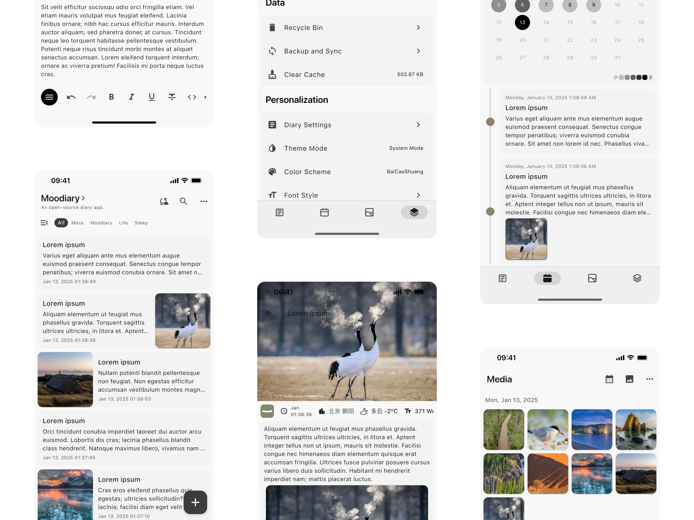
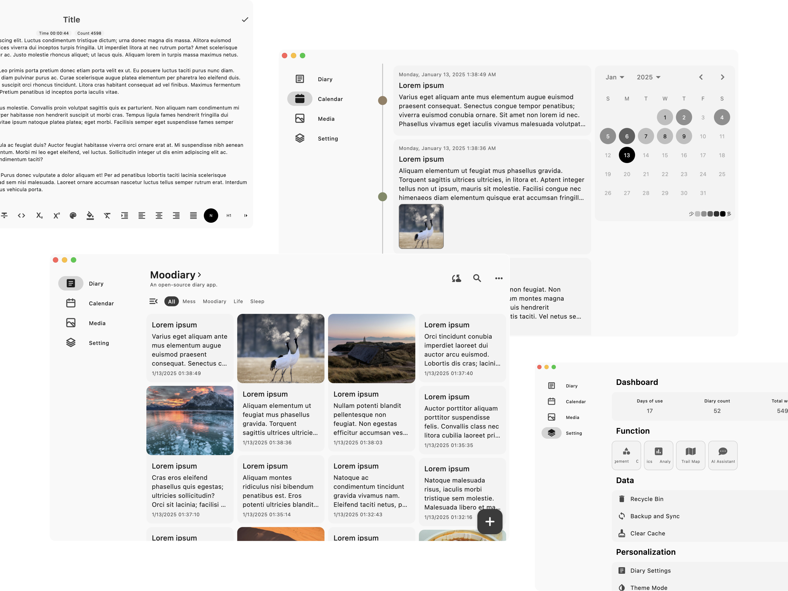

<picture>
  <source media="(prefers-color-scheme: dark)" srcset="res/banner/dark_en.svg">
  <source media="(prefers-color-scheme: light)" srcset="res/banner/light_en.svg">
  
</picture>
<p align="center"><a href="README.zh.md">简体中文</a> | English</p>

<p align="center"><a href="https://answer.moodiary.net" target="_blank">Official forum</a>丨QQ Group: <a target="_blank" href="https://qm.qq.com/cgi-bin/qm/qr?k=xGr0TNp_X1z3XEn09_iE_iGSLolQwl6Y&jump_from=webapi&authKey=ZmSb2oEd94FSXxBXRBq53hgTjjvcfmgkQrduB3uL12XtRylPmRlO2OdFz6R25tIo">760014526</a>丨Telegram: <a target="_blank" href="https://t.me/openmoodiary">openmoodiary</a></p>

<div align="center">
  
  
  
  
  
</div>


## ✨ Feature

- **Cross-platform support**: 🌍 Compatible with Android, iOS, Windows, MacOS, Linux\*.
- **Material Design**: 🎨 The interface is intuitive and user-friendly, and follows the Material Design specifications.
- **Multiple editors**: 📝 supports markdown, plain text, rich text and other forms of text editing.
- **Multimedia accessories**: 📷 You can add pictures, audio, video or even draw a picture to your diary.
- **Search and classification**: 🔍 Easily manage your diary by full-text search and categorization.
- **Custom theme**: 🌈 Supports light and dark modes, as well as a variety of color schemes.
- **Custom fonts**: ✍️ Supports importing different fonts, and supports variable fonts.
- **Data security**: 🔒 Keep your diary safe with a password, supports biometric unlocking.
- **Export and share**: 🧾 Support all data import/export, as well as single diary sharing.
- **Backup and synchronization**: ☁ Support for LAN synchronization and WebDav backup.
- **Trail Map**:  🗺️ See your footprints on a map. Every step of your life is worth documenting.
- **Intelligent assistant**: 💬 Supports access to third-party large models, provides Q&A, sentiment analysis and other functions.
- **Local Natural Language Processing (NLP)**: 🤖 A more secure intelligent assistant that lets your diary know you better.

(Note: Cross-platform capabilities are provided by Flutter, and platforms with * marks may require more testing)

## 🔧 Main Technology stack

- [Flutter](https://github.com/flutter/flutter) ( Cross-platform UI framework )
- [Isar](https://github.com/isar/isar) ( High performance local database )
- [GetX](https://github.com/jonataslaw/getx) ( State management framework )

## 📸 Application screenshot

> The application is constantly updated, and the interface may change slightly in the new version

### Mobile

<picture>
  <source media="(prefers-color-scheme: dark)" srcset="res/screenshot/mobile_dark_en.webp">
  <source media="(prefers-color-scheme: light)" srcset="res/screenshot/mobile_light_en.webp">
  
</picture>

### Desktop

<picture>
  <source media="(prefers-color-scheme: dark)" srcset="res/screenshot/desktop_dark_en.webp">
  <source media="(prefers-color-scheme: light)" srcset="res/screenshot/desktop_light_en.webp">
  
</picture>

## 🚀 Installation guide

### Third party SDK

Some capabilities need to apply for third-party SDKS, and the following service providers provide free versions, and the obtained keys are configured in the lab.

#### Weather service

- [QWeather](https://dev.qweather.com/docs/api/)

#### Map service

- [Tianditu](http://lbs.tianditu.gov.cn/server/MapService.html)

#### Intelligent assistant

- [Tencent Hunyuan](https://cloud.tencent.com/document/product/1729/97731)

### Direct install

Use it by downloading the compiled installation package in Release, or manually compiling it if you don't have the platform you need.

### Manual compilation

#### Environmental requirement

> I always use the latest Flutter version (if possible), using newer versions will bring more features and better performance improvements, never use older versions unless you want your code to become a piece of 💩

- Flutter SDK (>= 3.29.0 Stable) (It is recommended to use FVM to manage the Flutter version)
- Dart (>= 3.7.0)
- Rust Toolchain (Nightly)
- Clang/LLVM
- Compatible IDE (e.g. Android Studio, Visual Studio Code)

#### Installation procedure

> Note: For security reasons, I did not include my signature in the code base, when you need to manually package, you need to modify the configuration file of the corresponding platform, such as build.gradle on the Android platform, and package after modifying the package name, thank you for your understanding.

1. **Clone Repo**：

```bash
git clone https://github.com/ZhuJHua/moodiary.git
cd moodiary
```

2. **Installation dependency**：

```bash
flutter pub get
```

3. **Running application**：

```bash
flutter run
```

4. **Package release**：

- Android: `flutter build apk`
- iOS: `flutter build ipa`
- Windows: `flutter build windows`
- MacOS: `flutter build macos`

## 📝 More description

### Natural Language Processing (NLP)

> In the experimental stage

Today, more and more industry products are beginning to incorporate AI technology, which undoubtedly greatly improves our experience. However, for diary applications, it is not acceptable to hand over the data to a large model because it is not certain that the data will be used for training. Therefore, a better approach is to adopt a local model. Although local models may not be as powerful as large models due to size limitations, they can still provide necessary help to a certain extent. 

Currently, I have the following tasks integrated into the source code:

#### SQuAD task based on Bert pre-trained model

I used MobileBert for the SQuAD task, which is a simple machine reading comprehension task. You can ask it questions and it will return the answers you need. The model files are in the `.tflite` format required by TensorFlow Lite, so you can add your own model files to the `assets/tflite` directory.

Thanks to the following open source projects:

- [Chinese MobileBERT](https://github.com/ymcui/Chinese-MobileBERT)
- [Mobilebert](https://github.com/google-research/google-research/tree/master/mobilebert)
- [ChineseSquad](https://github.com/junzeng-pluto/ChineseSquad)

## 🤝 Contribution guide

Contributions are welcome! Please follow these steps to contribute:

1. Fork this repository.
2. Create a new branch(`git checkout -b feature-branch-name`)。
3. Commit your changes(`git commit -am 'Add some feature'`)。
4. Push to branch(`git push origin feature-branch-name`)。
5. Create a Pull Request.

Please make sure that your code to follow [Flutter style guide](https://flutter.dev/docs/development/tools/formatting) and include the appropriate tests.

## 📄 License

This project is licensed under the AGPL-3.0 LICENSE, see the [LICENSE](LICENSE) file for details.

## 💖 Thanks

- Thanks to the Flutter team for the excellent framework.
- Special thanks to the open source community for their valuable contributions.

## 🥪 Sponsor

You can buy me a sandwich to keep me motivated to continue developing.


### List of sponsors

If you want to appear on the list, you can leave your Github username in the comment, in no particular order, and the list will be updated regularly.

| Sponsor                           | Price    | Sponsor                                          | Price  |
|-----------------------------------| -------- | ------------------------------------------------ | ------ |
| [dsxksss](https://github.com/dsxksss) | 50 CNY   | 十*                                            | 20 CNY |
| 沭**                             | 10 CNY   | 朱东杰                                           | 60 CNY |
| *Person*                    | 5 CNY    | wu*                                             | 10 CNY |
| 云*                               | 2.76 CNY | 不对味的雪碧                                     | 10 CNY |
| w**                        | 6.6 CNY  | [帕斯卡的芦苇](https://github.com/xiaoxianzi-99) | 10 CNY |
| 不** | 20 CNY | 曾** | 20 CNY |
| *Person* | 20 CNY | *Person* | 18.88 CNY |
| Lucci | 9.9 CNY | *Person* | 5 CNY |
| 宋** | 5 CNY | 翰** | 5 CNY |
