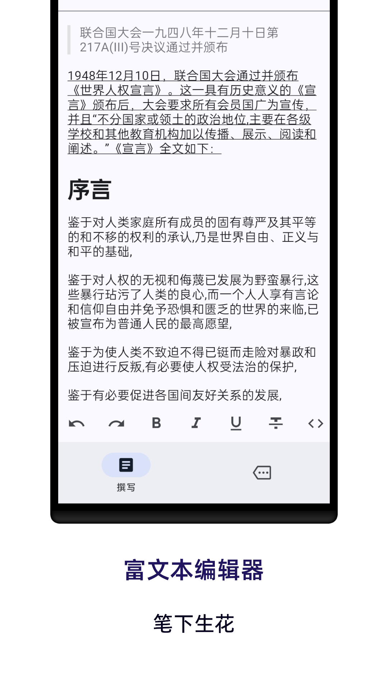

# 📔 心绪日记

[简体中文](README.md) | [English](README.en.md)

「心绪日记」 是一个由 Flutter 构建的跨平台日记应用，采用 Material Design 设计。它支持富文本编辑，让你可以轻松地在 Android 和 iOS 设备上创建和管理个人日记。

## ✨ 功能特性

- **跨平台支持**：🌍 兼容 Android、iOS、Windows（即将支持）。
- **Material Design**：🎨 界面直观且用户友好，遵循 Material Design 设计规范。
- **富文本编辑**：📝 支持加粗、斜体、下划线等多种格式的文本编辑。
- **多媒体附件**：📷 可以为你的日记添加图片、音频和视频。
- **搜索和标签**：🔍 轻松搜索和通过标签分类你的日记。
- **可自定义主题**：🌈 支持选择浅色和深色模式，或自定义主题。
- **数据安全**：🔒 通过密码来保障你的日记安全。
- **云同步（即将支持）**：☁️ 支持在多个设备间同步日记。

## 📸 应用截图

### Andriod

|  |  |
| ------------------------------ | ------------------------------ |


## 🚀 安装指南

### 环境要求

- Flutter SDK (>= 3.24.0)
- Dart (>= 3.5.0)
- 兼容的 IDE（如 Android Studio、Visual Studio Code）

### 安装步骤

1. **克隆仓库**：

   ```bash
   
   cd mydiaryapp
   ```

2. **安装依赖**：

   ```bash
   flutter pub get
   ```

3. **运行应用**：

   ```bash
   flutter run
   ```

4. **打包发布**：

    - Android: `flutter build apk`
    - iOS: `flutter build ios`

## 📝 使用说明

安装完成后，你可以通过点击“新建日记”按钮开始创建日记条目。使用富文本编辑器来格式化你的内容，添加多媒体附件，并通过标签进行组织。

## 🤝 贡献指南

欢迎贡献！请按照以下步骤进行贡献：

1. Fork 本仓库。
2. 创建一个新分支（`git checkout -b feature-branch-name`）。
3. 提交你的修改（`git commit -am 'Add some feature'`）。
4. 推送到分支（`git push origin feature-branch-name`）。
5. 创建一个 Pull Request。

请确保你的代码遵循 [Flutter 风格指南](https://flutter.dev/docs/development/tools/formatting) 并包含适当的测试。

## 📄 许可证

此项目基于 MIT 许可证进行许可，详情请参阅 [LICENSE](LICENSE) 文件。

## 💖 鸣谢

- 感谢 Flutter 团队提供出色的框架。
- 特别感谢开源社区的宝贵贡献。