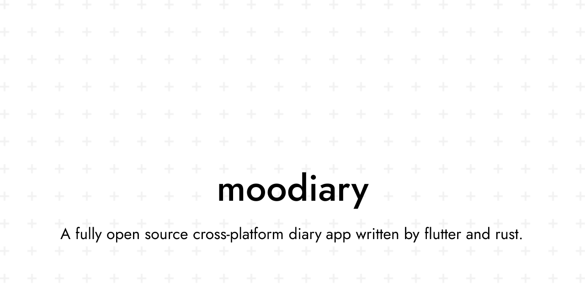

<p align="center"><a href="README.zh.md">简体中文</a> | English</p>

<p align="center"><a href="https://answer.moodiary.net" target="_blank">Official forum</a>丨QQ Group: <a target="_blank" href="https://qm.qq.com/cgi-bin/qm/qr?k=xGr0TNp_X1z3XEn09_iE_iGSLolQwl6Y&jump_from=webapi&authKey=ZmSb2oEd94FSXxBXRBq53hgTjjvcfmgkQrduB3uL12XtRylPmRlO2OdFz6R25tIo">760014526</a>丨Telegram: <a target="_blank" href="https://t.me/openmoodiary">openmoodiary</a></p>

<div align="center">
  
  
  
  
  
</div>


## ✨ Feature

- **Mobile first**: 📱 Android and iOS are supported for now.
- **Material Design**: 🎨 The interface is intuitive and user-friendly, and follows the Material Design specifications.
- **Rich text editing**: 📝 A TipTap based editor, legacy markdown / rich text diaries can be migrated in one tap.
- **Multimedia accessories**: 📷 You can add pictures, audio, video or even draw a picture to your diary.
- **Search and classification**: 🔍 Easily manage your diary by full-text search and categorization.
- **Custom theme**: 🌈 Supports light and dark modes, as well as a variety of color schemes.
- **Custom fonts**: ✍️ Supports importing different fonts, and supports variable fonts.
- **Data security**: 🔒 Keep your diary safe with a password, supports biometric unlocking.
- **Export and share**: 🧾 Export to Markdown / Word / PDF / long image, import from a Markdown zip or a local backup; sharing a single entry is just an export scoped to one diary.
- **Backup and synchronization**: ☁ Support for WebDAV, S3 / MinIO and LAN sync, with optional end-to-end encryption.
- **Weather and places**: 🗺️ Pick the weather by hand or fetch it, save the places you go and reference them from entries, and see your footprints on a map.
- **Intelligent assistant**: 💬 Supports access to third-party large models, provides Q&A, diary tool calls, sentiment analysis and other functions.

## 🔧 Main Technology stack

- [Flutter](https://github.com/flutter/flutter) ( Cross-platform UI framework )
- [Rust](https://github.com/rust-lang/rust) + [flutter_rust_bridge](https://github.com/fzyzcjy/flutter_rust_bridge) ( Image pipeline, typesetting, crypto, networking and tokenisation — six native libraries built through Native Assets build hooks )
- [drift](https://pub.dev/packages/drift) ( SQLite with FTS5 full-text search )
- [Riverpod](https://github.com/rrousselGit/riverpod) ( UI state ) + [get_it](https://pub.dev/packages/get_it) / [injectable](https://pub.dev/packages/injectable) ( the object graph )
- [ONNX Runtime](https://pub.dev/packages/onnxruntime_plus) ( on-device embedding and mood models )

## 📸 Application screenshot

> The application is constantly updated, and the interface may change slightly in the new version

<picture>
  <source media="(prefers-color-scheme: dark)" srcset="res/screenshot/mobile_dark_en.webp">
  <source media="(prefers-color-scheme: light)" srcset="res/screenshot/mobile_light_en.webp">
  
</picture>

## 🚀 Installation guide

### Third party SDK

Some capabilities need to apply for third-party SDKS, and the following service providers provide free versions, and the obtained keys are configured in Settings → Third-party services.

#### Weather service

- [QWeather](https://dev.qweather.com/docs/api/)

#### Map service

- [Tianditu](http://lbs.tianditu.gov.cn/server/MapService.html)

#### Intelligent assistant

The assistant is built on [rig](https://github.com/0xPlaygrounds/rig). Add the API key of any OpenAI / Anthropic compatible provider under Assistant settings → Model providers, the key is only kept in the local secure storage.

### Direct install

Use it by downloading the compiled installation package in Release, or manually compiling it if you don't have the platform you need.

### Manual compilation

#### Environmental requirement

> I always use the latest Flutter version (if possible), using newer versions will bring more features and better performance improvements, never use older versions unless you want your code to become a piece of 💩

- Flutter SDK (>= 3.47.0 Stable; `.fvmrc` pins 3.47.2 — use FVM so you get exactly that)
- Dart (>= 3.13.0)
- Rust 1.95.0 stable (rustup reads each package's `rust-toolchain.toml`; the native libraries are built by build hooks)
- Clang/LLVM
- Node + Corepack (to build the editor web bundle)
- Compatible IDE (e.g. Android Studio, Visual Studio Code)

#### Installation procedure

> Note: For security reasons, I did not include my signature in the code base, when you need to manually package, you need to modify the configuration file of the corresponding platform, such as build.gradle on the Android platform, and package after modifying the package name, thank you for your understanding.

1. **Clone Repo**：

```bash
git clone https://github.com/ZhuJHua/moodiary.git
cd moodiary
```

2. **Installation dependency**：

```bash
fvm use
dart tool/task.dart setup
```

3. **Running application**：

```bash
dart tool/task.dart run
```

4. **Package release**：

- Android: `dart tool/task.dart build-apk`
- iOS: `dart tool/task.dart build-ios`

> Run `dart tool/task.dart` for the full command list; extra flutter flags go after `--`, e.g. `dart tool/task.dart run -- --release`.

## 📦 Project structure

The repo is a pub workspace + Melos monorepo. 33 shared packages sit in four layers — `foundation → core → feature_base → feature` — and a feature never imports another feature; shared logic sinks down a layer and cross-feature composition happens in the app. The direction is enforced by `tool/check_layers.dart` at a zero baseline, not left to convention.

```
mobile/      the app (Android / iOS), a thin composition root
packages/
  foundation/  leaf layer: DI, logging, i18n, router, design system, the six Rust packages
  core/        domain-free infrastructure: platform, http, storage, files, theme
  feature_base/ models, database, shared components, editor, on-device ML
  feature/     diary, export, sync, assistant, media, lock
tool/        cross-platform task entry (task.dart) and the layer/codegen gates
```

A desktop app will be rebuilt later — the packages are already layered for it, but no desktop target exists in the tree today.

## 🤝 Contribution guide

Contributions are welcome! Please follow these steps to contribute:

1. Fork this repository.
2. Create a new branch (`git checkout -b feature-branch-name`).
3. Commit your changes (`git commit -am 'Add some feature'`).
4. Push to branch (`git push origin feature-branch-name`).
5. Create a Pull Request.

Before you open the PR, run the full check — `dart tool/task.dart analyze` and `dart tool/task.dart test`. If you touched annotations, `i18n/*.json` or `rust/src/api`, run the matching generator (`build-runner` / `i18n` / `gen-rust`) and commit the generated output with your change; it is tracked in the repo. Longer contributor docs live at [docs.moodiary.net](https://docs.moodiary.net).

### Contributors

<a href="https://github.com/ZhuJHua/moodiary/graphs/contributors">
  
</a>

## 📄 License

This project is licensed under the AGPL-3.0 LICENSE, see the [LICENSE](LICENSE) file for details.

## 💖 Thanks

- Thanks to the Flutter team for the excellent framework.
- Special thanks to the open source community for their valuable contributions.

## 🥪 Sponsor

You can buy me a sandwich to keep me motivated to continue developing.


### List of sponsors

In no particular order of amount. Leave your GitHub username in the transfer note if you want to be listed with a link.

<picture>
  <source media="(prefers-color-scheme: dark)" srcset="res/sponsor/sponsors_dark.svg">
  <source media="(prefers-color-scheme: light)" srcset="res/sponsor/sponsors_light.svg">
  
</picture>

> The wall is generated from [`sponsors.json`](sponsors.json) by `dart tool/task.dart sponsors`; CI re-renders it whenever that file changes. Edit the JSON, never the SVG.
