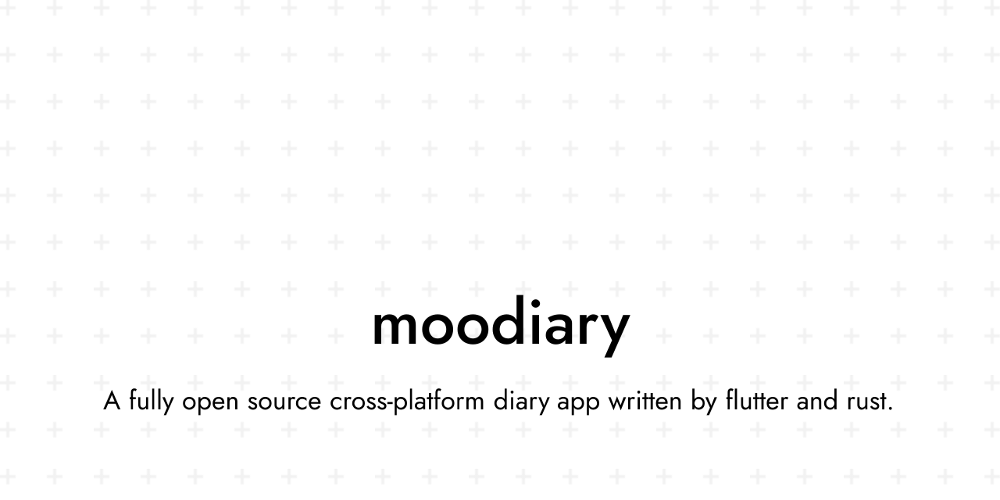

<picture>
  <source media="(prefers-color-scheme: dark)" srcset="res/social_dark.svg">
  <source media="(prefers-color-scheme: light)" srcset="res/social_light.svg">
  
</picture>

<a href="README.zh.md">简体中文</a> | English

<a href="https://docs.moodiary.net" target="_blank">Docs</a>丨<a href="https://answer.moodiary.net" target="_blank">Forum</a>丨QQ group: <a target="_blank" href="https://qm.qq.com/cgi-bin/qm/qr?k=xGr0TNp_X1z3XEn09_iE_iGSLolQwl6Y&jump_from=webapi&authKey=ZmSb2oEd94FSXxBXRBq53hgTjjvcfmgkQrduB3uL12XtRylPmRlO2OdFz6R25tIo">760014526</a>丨Telegram: <a target="_blank" href="https://t.me/openmoodiary">openmoodiary</a>

  
  
  
  
  

  
  

## ✨ Features

- **Rich text**: insert images, audio and video.
- **Search and categories**: full-text search and per-category filtering.
- **Themes and fonts**: light and dark modes, several color schemes, and imported fonts including variable fonts.
- **App lock**: a password with biometric unlock.
- **Export, import and share**: export to Markdown, Word, PDF or a long image, and import from a Markdown zip or a local backup.
- **Backup and sync**: WebDAV, S3 / MinIO and LAN sync, with optional end-to-end encryption.
- **Weather and places**: pick or fetch the weather, save places and reference them from entries, and view your footprints on a map.
- **Assistant**: connect any OpenAI- or Anthropic-compatible provider for chat and diary tools.

## 🚀 Getting started

Download an installer from [Releases](https://github.com/ZhuJHua/moodiary/releases). The app works offline out of the box.

Everything else is in the docs at [docs.moodiary.net](https://docs.moodiary.net).

## 🤝 Contributors

## 🥪 Sponsor

If Moodiary is useful to you, you can [buy me a sandwich](https://yooss.cn/sponsor.html).
