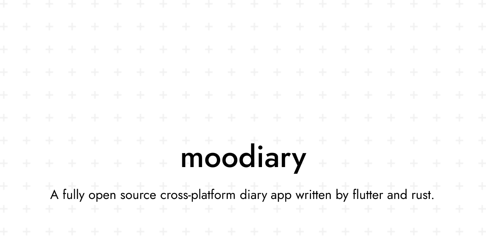

<picture>
  <source media="(prefers-color-scheme: dark)" srcset="res/social_dark.svg">
  <source media="(prefers-color-scheme: light)" srcset="res/social_light.svg">
  
</picture>

简体中文 | <a href="README.md">English</a>

<a href="https://docs.moodiary.net" target="_blank">文档</a>丨<a href="https://answer.moodiary.net" target="_blank">论坛</a>丨QQ 群：<a target="_blank" href="https://qm.qq.com/cgi-bin/qm/qr?k=xGr0TNp_X1z3XEn09_iE_iGSLolQwl6Y&jump_from=webapi&authKey=ZmSb2oEd94FSXxBXRBq53hgTjjvcfmgkQrduB3uL12XtRylPmRlO2OdFz6R25tIo">760014526</a>丨Telegram：<a target="_blank" href="https://t.me/openmoodiary">openmoodiary</a>

  
  
  
  
  

## ✨ 功能

- **富文本**：可插入图片、音频与视频。
- **搜索与分类**：全文搜索，按分类筛选。
- **主题与字体**：浅色与深色模式、多种配色，支持导入字体，包括可变字体。
- **应用锁**：密码保护，支持生物识别解锁。
- **导出、导入与分享**：导出为 Markdown、Word、PDF 或长图，可从 Markdown 压缩包或本地备份导入。
- **备份与同步**：WebDAV、S3 / MinIO 与局域网同步，可选端到端加密。
- **天气与地点**：天气可手选或自动获取。常去的地方可以保存下来供日记引用，并在地图上查看足迹。
- **智能助手**：接入任意 OpenAI 或 Anthropic 兼容的供应商，提供问答、日记工具调用与心情建议。

## 🚀 开始使用

在 [Releases](https://github.com/ZhuJHua/moodiary/releases) 下载安装包。应用离线即可使用。

其余内容请参阅文档站 [docs.moodiary.net](https://docs.moodiary.net)。

## 🤝 贡献者

## 🥪 捐助

如果 Moodiary 对你有用，可以请我吃个三明治。

### 捐助者

如果想出现在名单上，请在赞赏备注中留下 GitHub 用户名或昵称。自选昵称须符合法律法规，否则不予展示。

<!-- sponsors:start -->
朱东杰、[dsxksss](https://github.com/dsxksss)、不对味的雪碧、[xiaoxianzi-99](https://github.com/xiaoxianzi-99)、Lucci、[Higanoneko](https://github.com/Higanoneko)、h
<!-- sponsors:end -->
