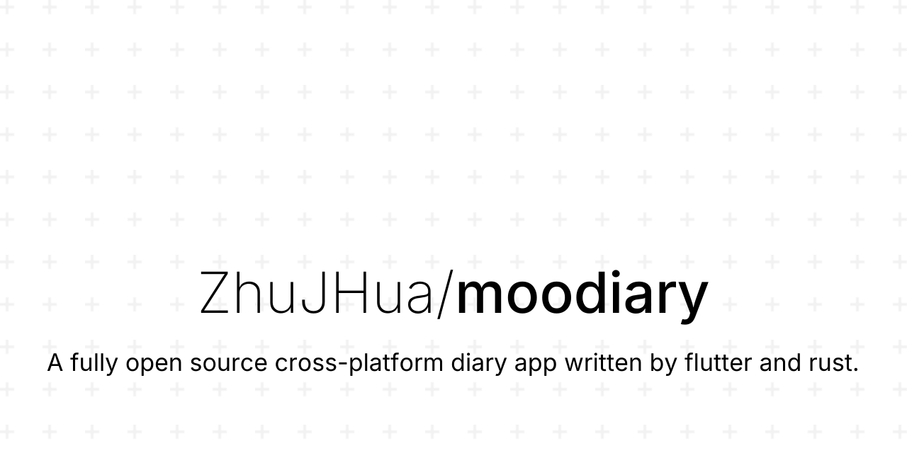
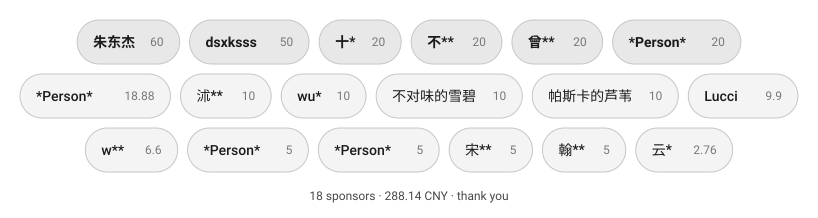

<picture>
  <source media="(prefers-color-scheme: dark)" srcset="mobile/res/banner/social_dark.svg">
  <source media="(prefers-color-scheme: light)" srcset="mobile/res/banner/social_light.svg">
  
</picture>
<p align="center">简体中文 | <a href="README.md">English</a></p>

<p align="center"><a href="https://answer.moodiary.net" target="_blank">官方论坛</a>丨QQ群: <a target="_blank" href="https://qm.qq.com/cgi-bin/qm/qr?k=xGr0TNp_X1z3XEn09_iE_iGSLolQwl6Y&jump_from=webapi&authKey=ZmSb2oEd94FSXxBXRBq53hgTjjvcfmgkQrduB3uL12XtRylPmRlO2OdFz6R25tIo">760014526</a>丨Telegram: <a target="_blank" href="https://t.me/openmoodiary">openmoodiary</a></p>

<div align="center">
  
  
  
  
  
</div>


## ✨ 功能特性

- **移动端优先**：📱 目前支持 Android 与 iOS。
- **Material Design**：🎨 界面直观且用户友好，遵循 Material Design 设计规范。
- **富文本编辑**：📝 基于 TipTap 的编辑器，旧版 Markdown / 富文本日记可一键迁移。
- **多媒体附件**：📷 可以为你的日记添加图片、音频、视频甚至画一张画。
- **搜索和分类**：🔍 轻松通过全文搜索及分类管理你的日记。
- **自定义主题**：🌈 支持浅色和深色模式，以及多种配色的主题。
- **自定义字体**：✍️ 支持导入不同的字体，并支持可变字体。
- **数据安全**：🔒 通过密码来保障你的日记安全，支持通过生物识别解锁。
- **导出和分享**：🧾 导出为 Markdown / Word / PDF / 长图，支持从 Markdown 压缩包或本地备份导入；分享一篇日记就是一次只含一篇的导出。
- **备份与同步**：☁ 支持 WebDAV、S3 / MinIO 与局域网同步，同步数据可端到端加密。
- **天气与地点**：🗺️ 天气可手选也可自动获取，常去的地方存成「常用地点」由日记引用，足迹地图上查看你的每一步。
- **智能助手**：💬 支持接入第三方大模型，提供问答、日记工具调用、情绪分析等功能。

## 🔧 主要技术栈

- [Flutter](https://github.com/flutter/flutter)（跨平台 UI 框架）
- [Rust](https://github.com/rust-lang/rust) + [flutter_rust_bridge](https://github.com/fzyzcjy/flutter_rust_bridge)（图片管线、排版压印、加密、网络与分词，六个原生库经 Native Assets 构建钩子编译）
- [drift](https://pub.dev/packages/drift)（SQLite，带 FTS5 全文检索）
- [Riverpod](https://github.com/rrousselGit/riverpod)（界面状态）+ [get_it](https://pub.dev/packages/get_it) / [injectable](https://pub.dev/packages/injectable)（对象图）
- [ONNX Runtime](https://pub.dev/packages/onnxruntime_plus)（端侧嵌入与心情模型）

## 📸 应用截图

> 应用持续更新中，新版本界面可能稍有变化

<picture>
  <source media="(prefers-color-scheme: dark)" srcset="mobile/res/screenshot/mobile_dark_zh.webp">
  <source media="(prefers-color-scheme: light)" srcset="mobile/res/screenshot/mobile_light_zh.webp">
  
</picture>

## 🚀 安装指南

### 第三方 SDK

某些能力需要自行申请第三方 SDK，下列服务商均提供免费的版本，获取到的 Key 在「设置 → 第三方服务」中配置。

#### 天气服务

- [和风天气](https://dev.qweather.com/docs/api/)

#### 地图服务

- [天地图](http://lbs.tianditu.gov.cn/server/MapService.html)

#### 智能助手

助手基于 [rig](https://github.com/0xPlaygrounds/rig) 构建，在「助手设置 → 模型供应商」中填入任意 OpenAI / Anthropic 兼容服务商的 API Key 即可使用，Key 仅保存在本机安全存储。

### 直接安装

通过下载 Release 中已编译好的安装包来使用，如果没有你所需要的平台，请使用手动编译。

### 手动编译

#### 环境要求

> 我总是会使用最新的 Flutter 版本（如果可能的话），使用新版本可以带来更多的功能和更好的性能提升，永远不要使用老版本除非你希望代码变成一坨 💩

- Flutter SDK (>= 3.47.0 Stable)（建议使用 fvm 来管理 flutter 版本，仓库在 `.fvmrc` 里钉死了版本）
- Dart (>= 3.13.0)
- Rust 工具链（rustup，原生库由构建钩子编译）
- Clang/LLVM
- Node + Corepack（编译编辑器 Web 产物）
- 兼容的 IDE（如 Android Studio、Visual Studio Code）

#### 安装步骤

> 注意：出于安全考虑，我并没有在代码库中包含我的签名，当您需要手动打包时，需要自己修改对应平台的配置文件，例如安卓平台的 build.gradle，修改包名后打包，感谢您的理解

1. **克隆仓库**：

```bash
git clone https://github.com/ZhuJHua/moodiary.git
cd moodiary
```

2. **安装依赖**：

```bash
fvm use
dart tool/task.dart setup
```

3. **运行应用**：

```bash
dart tool/task.dart run
```

4. **打包发布**：

- Android: `dart tool/task.dart build-apk`
- iOS: `dart tool/task.dart build-ios`

> 更多命令用 `dart tool/task.dart` 查看；额外的 flutter 参数写在 `--` 之后，如 `dart tool/task.dart run -- --release`。

## 📦 项目结构

仓库是 pub workspace + Melos 单体仓库。33 个共享包分四层 —— `foundation → core → feature_base → feature` —— 上层依赖下层，**feature 之间零互引**：共用逻辑下沉一层，跨 feature 的组合放在 app 层。方向由 `tool/check_layers.dart` 以零基线强制，不靠自觉。

```
mobile/      应用本体（Android / iOS），一个很薄的组合根
packages/
  foundation/   叶子层：DI、日志、i18n、路由、设计系统，以及六个 Rust 包
  core/         无领域基建：平台、http、存储、文件、主题
  feature_base/ 模型、数据库、共用组件、编辑器、端侧 ML
  feature/      日记、导出、同步、助手、媒体、应用锁
tool/        跨平台任务入口（task.dart）与分层 / 代码生成闸门
```

桌面端会在将来重建 —— 包已经按它分好层了，但目前树里没有桌面目标。

## 🤝 贡献指南

欢迎参与贡献！请按以下步骤进行：

1. Fork 本仓库。
2. 新建分支（`git checkout -b feature-branch-name`）。
3. 提交你的改动（`git commit -am 'Add some feature'`）。
4. 推送到分支（`git push origin feature-branch-name`）。
5. 创建 Pull Request。

提 PR 之前请跑一遍完整检查：`dart tool/task.dart analyze` 与 `dart tool/task.dart test`。如果动了注解、`i18n/*.json` 或 `rust/src/api`，要跑对应的生成命令（`build-runner` / `i18n` / `gen-rust`）并把生成物一起提交 —— 它们是进仓库的。更完整的贡献者文档见 [docs.moodiary.net](https://docs.moodiary.net)。

### 代码贡献者

<a href="https://github.com/ZhuJHua/moodiary/graphs/contributors">
  
</a>

## 📄 许可证

本项目使用 AGPL-3.0 许可证，详情见 [LICENSE](LICENSE) 文件。

## 💖 鸣谢

- 感谢 Flutter 团队提供的优秀框架。
- 特别感谢开源社区的宝贵贡献。

## 🥪 捐助

你可以请我吃个三明治，让我更有动力继续开发。


### 捐助者名单

不分先后，按金额排列。想在名单里带上链接的，转账备注里留个 GitHub 用户名就行。

<picture>
  <source media="(prefers-color-scheme: dark)" srcset="mobile/res/sponsor/sponsors_dark.svg">
  <source media="(prefers-color-scheme: light)" srcset="mobile/res/sponsor/sponsors_light.svg">
  
</picture>

> 这面墙由 [`sponsors.json`](sponsors.json) 经 `dart tool/task.dart sponsors` 生成，CI 会在该文件变动时重新渲染。改 JSON，别改 SVG。
